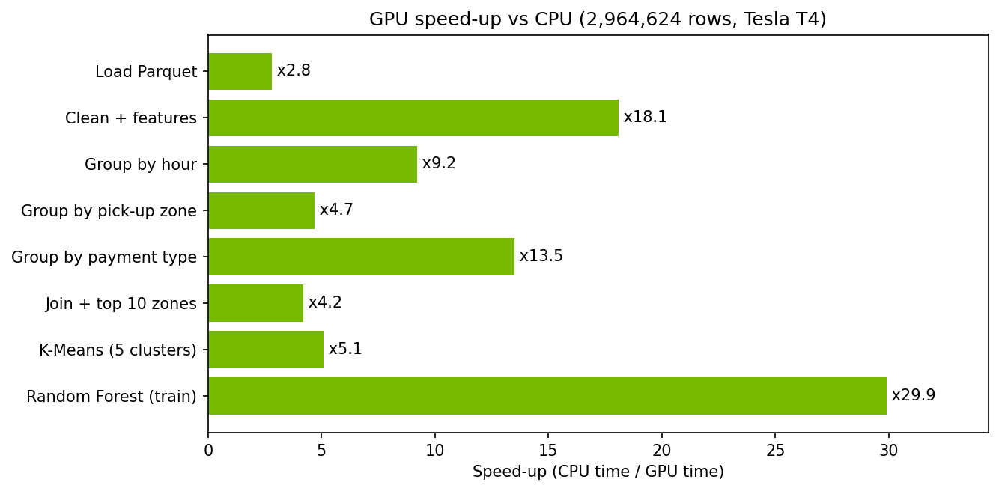
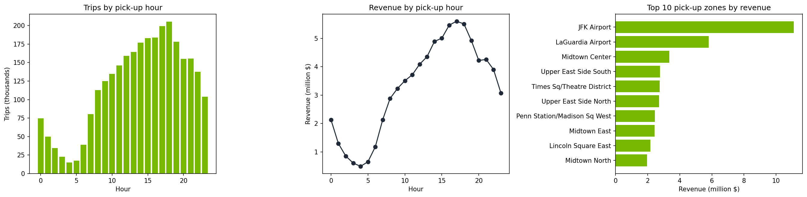

# GPU-Accelerated Data Analysis with NVIDIA RAPIDS

The same data analysis is run twice, on CPU (pandas, scikit-learn) and on GPU (NVIDIA RAPIDS **cuDF** and **cuML**), and the speed-up is measured at each step. The case study uses millions of New York City yellow taxi trips.

**Result: the full pipeline ran in 1.8 s on GPU instead of 38.6 s on CPU (x21.5), with the same model accuracy.**



## What the notebook does

| Step | CPU | GPU |
|---|---|---|
| Load Parquet files | pandas | cuDF |
| Clean data and create features (duration, speed, tip %, hour, weekday) | pandas | cuDF |
| Business aggregations by hour, zone and payment type | pandas | cuDF |
| Join with the taxi zone table, top 10 zones by revenue | pandas | cuDF |
| Trip segmentation (K-Means, 5 clusters) | scikit-learn | cuML |
| Tip prediction (Random Forest, card payments) | scikit-learn | cuML |

Each timing is the median of several runs. Both versions use the same code, data and parameters, so the comparison is fair. The Random Forest R² is compared too, to check that the GPU does not reduce accuracy.

## Results

Measured in `notebooks/gpu_taxi_analytics.ipynb` on Google Colab: **NVIDIA Tesla T4** (16 GB) vs **Intel Xeon @ 2.00 GHz (2 vCPUs)**, January 2024 data (**2,964,624 trips**, 2,855,773 after cleaning). Each timing is the median of 3 runs (1 run for K-Means and Random Forest).

| Step | CPU (s) | GPU (s) | Speed-up |
|---|---|---|---|
| Load Parquet | 0.318 | 0.115 | x2.8 |
| Clean + features | 1.691 | 0.093 | x18.1 |
| Group by hour | 0.100 | 0.011 | x9.2 |
| Group by pick-up zone | 0.072 | 0.015 | x4.7 |
| Group by payment type | 0.098 | 0.007 | x13.5 |
| Join + top 10 zones | 0.077 | 0.019 | x4.2 |
| K-Means (5 clusters) | 1.993 | 0.390 | x5.1 |
| Random Forest (train, 400k rows) | 34.262 | 1.147 | x29.9 |
| **Total** | **38.611** | **1.797** | **x21.5** |

**Model quality is preserved:** Random Forest R² on the test set is 0.634 with scikit-learn and 0.622 with cuML.

Software: pandas 2.2.3, scikit-learn 1.6.1, cuDF 26.02.01, cuML 26.02.000. Speed-ups depend on the hardware and on the data volume.

## Key business insights



- **Peak demand:** trips peak at 18:00 (205,433 trips) and revenue peaks at 17:00 ($5.61M). The quietest hour is 04:00 (15,095 trips).
- **Airports drive revenue:** JFK Airport is the top pick-up zone with $11.1M in revenue from 136,821 trips (16 miles on average), about 3.3x Midtown Center, which has a similar number of trips. LaGuardia is second with $5.8M.
- **Tips:** card payments average a $4.15 tip (26.3% of the fare). Cash tips are not recorded in the data, so they show as $0.
- **Trip segments (K-Means):**
  - Short evening city trips: 1.7 mi, 10 min, $11.8 fare, 36.6% of trips.
  - Short daytime city trips: 1.5 mi, 11 min, $11.5 fare, 32.7% of trips.
  - Medium trips: 6.4 mi, 27 min, $32.8 fare, 14.4% of trips.
  - Late-night short trips (around 3 a.m.): 2.4 mi, $14.0 fare, 10.4% of trips.
  - Long trips (airport-like): 17.6 mi, 46 min, $70.9 fare, 6.0% of trips, with the lowest tip rate (15%).

## How to run

1. Open `notebooks/gpu_taxi_analytics.ipynb` in [Google Colab](https://colab.research.google.com/).
2. Select *Runtime → Change runtime type → GPU*.
3. Run all cells. The notebook installs RAPIDS with the [official Colab script](https://docs.rapids.ai/deployment/stable/platforms/colab/) and downloads the data automatically.
4. To analyse more data, add months to `MONTHS` (for example `["2024-01", "2024-02", "2024-03"]`).

## Data

[NYC Taxi & Limousine Commission — Trip Record Data](https://www.nyc.gov/site/tlc/about/tlc-trip-record-data.page) (yellow taxi trips, monthly Parquet files) and the taxi zone lookup table. The data files are not stored in this repository.

Note: the TLC tip field only records credit card tips, so tip analysis uses card payments only.

## Tech stack

NVIDIA RAPIDS (cuDF, cuML), CUDA, pandas, scikit-learn, matplotlib, Google Colab.

## Repository structure

```
gpu-taxi-analytics/
├── README.md
├── notebooks/
│   └── gpu_taxi_analytics.ipynb
├── docs/          # charts exported by the notebook
└── results/       # benchmarks.csv exported by the notebook
```

## License

MIT
